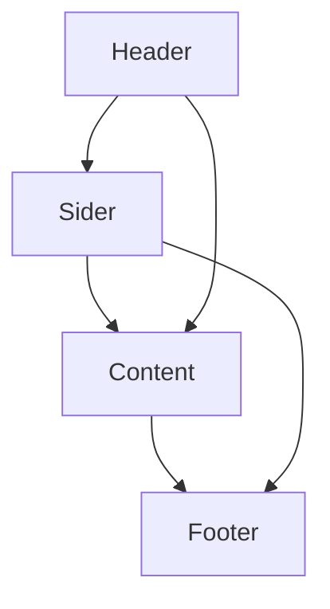

# 用户中心 Web 项目

这是一个基于 Vue 3 和 Vite 构建的用户中心前端项目，集成了 Ant Design Vue UI 组件库，旨在提供一个干净、现代的用户界面开发起点。

## 项目概览

本项目已清空 Vue 默认的样式和组件，例如 `App.vue` 中的初始布局和 `src/components` 目录下的示例组件。我们已经集成了 Ant Design Vue，方便快速构建美观的界面。

## 技术栈

- **前端框架**: Vue 3
- **构建工具**: Vite
- **UI 组件库**: Ant Design Vue
- **路由**: Vue Router
- **状态管理**: Pinia

## 目录结构说明

- `src/views/`: 存放主要页面组件。
- `src/router/`: 定义应用程序的路由配置。目前已添加 `HomeView` 作为默认主页路由，您可以在此添加其他新的页面路由。
- `src/stores/`: 存放 Pinia 状态管理模块。
- `src/assets/`: 存放静态资源（如图片、图标等），默认样式已移除。
- `src/main.ts`: 应用程序的入口文件，负责初始化 Vue 应用和注册全局插件（包括 Ant Design Vue）。
- `public/`: 存放静态公共资源。

## 推荐 IDE 设置

[VSCode](https://code.visualstudio.com/) + [Volar](https://marketplace.visualstudio.com/items?itemName=Vue.volar) (请禁用 Vetur)。

## `.vue` 导入的类型支持 (TypeScript)

TypeScript 默认无法处理 `.vue` 导入的类型信息，因此我们使用 `vue-tsc` 替代 `tsc` CLI 进行类型检查。在编辑器中，需要 [Volar](https://marketplace.visualstudio.com/items?itemName=Vue.volar) 来使 TypeScript 语言服务识别 `.vue` 类型。

## 项目设置

```sh
npm install
```

### 开发模式编译与热重载

```sh
npm run dev
```

### 生产模式类型检查、编译与压缩

```sh
npm run build
```

### 使用 [ESLint](https://eslint.org/) 进行代码规范检查

```sh
npm run lint
```

## 页面结构与布局

本项目已采用 Ant Design Vue 的 `Layout` 组件构建了标准的页面布局，主要划分为以下几个区域：

- **Header (页头)**: 位于页面顶部，通常包含网站 Logo、导航菜单或用户操作入口。
- **Sider (侧边栏)**: 位于内容区域的左侧，提供主要的功能导航菜单。
- **Content (内容区域)**: 位于侧边栏和页脚之间，是页面的主要内容展示区域。
- **Footer (页脚)**: 位于页面底部，通常包含版权信息、联系方式等。

**布局图示:**

我们实现了如下所示的经典布局结构：



### 样式说明

- **整体布局**: 采用 `a-layout` 包裹整个应用，并设置 `min-height: 100vh` 确保至少占据整个视口高度。
- **页头 (`PageHeader.vue`)**: 背景为白色，无默认内边距。包含一个简单的 Logo 占位符和水平导航菜单。
- **侧边栏 (`PageSider.vue`)**: 宽度固定为 200px，背景为白色。包含多级导航菜单，并引入了 Ant Design 的图标。
- **内容区域 (`PageContent.vue`)**: 背景为白色，有 24px 的内边距和外边距，最小高度为 280px，确保内容区域的可见性。
- **页脚 (`PageFooter.vue`)**: 文字居中显示，包含版权信息。
